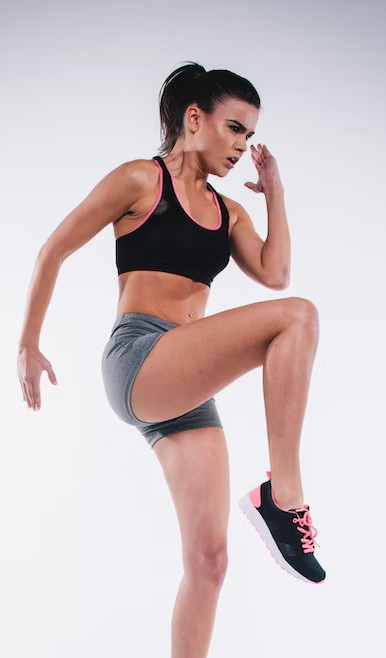

# AWS Certifications
## a concise guide for SREs

## Who am I?  

Javi Moreno

**Principal consultant, NTT Ltd**

AWS, Kubernetes, Azure, former developer

Amazon Authorized Instructor
Cloud posgrade co-director  

## Certification benefits

* Commitment improves our discipline, forcing us to **lock time for learning**
* Makes the candidate **professionally more appealing**
* Just like a hardcore training session, passing an exam is an **interesting challenge**!

## Certification map

::: Notes

Visit the [official AWS certification page](https://aws.amazon.com/certification/) to get more details
about this map.

## With a little help from...

* Ask for the **30 minutes extension**
* Architecting on AWS **official course**
* **[skillbuilder.aws](https://skillbuilder.aws/)**
* **Exam guides**, on each cert page
* **[workshops.aws](https://workshops.aws/)**
* **Sample questions**, available at the certification pages
* **[examtopics.com](https://examtopics.com)**, for learning your **unknown unknowns**

::: Notes

Information about the Architecting on AWS: https://aws.amazon.com/training/classroom/architecting-on-aws/

:::

## Q & A

Certs **are tools** for helping you to become a **better professional**

Prepare yourself and **go for that certification**!

**javi.moreno@global.ntt**

[bit.ly/sre-certs](https://github.com/ciberado/decks-aws-certs-sre/blob/91c3aa2587b046d8a520bb37bb8c83fb4889b1ab/presentation.pdf)

[bit.ly/javi-linkedin](https://linkedin.com/in/javier-more/)

[aws.amazon.com/certification](https://aws.amazon.com/certification/)