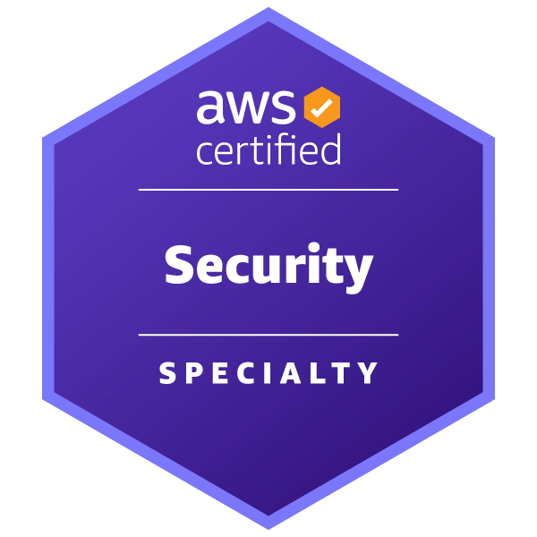

# AWS Certifications
## a concise guide for SREs

## Who am I?  

Javi Moreno

**Principal consultant, NTT Ltd**

AWS, Kubernetes, Azure, former developer

Amazon Authorized Instructor
Cloud posgrade co-director  

## Certification benefits

* Commitment improves our discipline, forcing us to **lock time for learning**
* Makes the candidate **professionally more appealing**
* Just like a hardcore training session, passing an exam is an **interesting challenge**!

## Certification map

::: Notes

Visit the [official AWS certification page](https://aws.amazon.com/certification/) to get more details
about this map.

## AWS Certified Solutions Architect - Associate

* **130** min to complete the exam
* **65** questions
* **720** passing score
* The **most versatile** certification
* Popular services, governance and IAM, best practices, networking,
computation, monitoring, scalability, caching, queueing, storage options, RDS,
containers, DR strategies

::: Notes

[Certification page](https://aws.amazon.com/certification/certified-solutions-architect-associate/?ch=sec&sec=rmg&d=1)

:::

## AWS Certified Solutions SysOps Administrator - Associate

* **130** minutes, **65** questions
* Very well-suited for SRE roles
* **Overlapping with Architecture** one makes easier to pass this exam
* Focus on **observability**, troubleshooting, and administration
* Hands-on **lab included** (or not)

::: Notes

[Certification page](https://aws.amazon.com/certification/certified-solutions-architect-associate/?ch=sec&sec=rmg&d=1)

:::

## AWS Certified DevOps Engineer - Professional

* **180** min to complete the exam
* **75** questions
* **750** passing score
* Difficult to prepare
* Questions from many **different domains**
* Many **security** related questions
* Unpopular services

::: Notes

[Certification page](https://aws.amazon.com/certification/certified-devops-engineer-professional/?ch=sec&sec=rmg&d=1)

:::

## Hashicorp Infrastructure Automation Certification

* **60** min to complete the exam
* **57** questions
* **70%** passing score
* Focused on **Terraform**
* Not very difficult
* **Great for learning** automation

::: Notes

[Certification page](https://www.hashicorp.com/certification/terraform-associate)

:::

## Specialties

* 
* 

::: Notes

### Security

* **170** min to complete the exam
* **65** questions
* **750** passing score
* **Not much more difficult** than the associated level
* **Narrower focus** than other exams
* **New version** available next July

### Advanced networking

* **170** min to complete the exam
* **65** questions
* **750** passing score
* **Tough exam**, at least for a former developer
* **Narrower focus** than other exams

:::

## With a little help from...

* Ask for the **30 minutes extension**
* Architecting on AWS **official course**
* **[skillbuilder.aws](https://skillbuilder.aws/)**
* **Exam guides**, on each cert page
* **[workshops.aws](https://workshops.aws/)**
* **Sample questions**, available at the certification pages
* **[examtopics.com](https://examtopics.com)**, for learning your **unknown unknowns**

::: Notes

Information about the Architecting on AWS: https://aws.amazon.com/training/classroom/architecting-on-aws/

:::

## Q & A

Certs **are tools** for helping you to become a **better professional**

Prepare yourself and **go for that certification**!

**javi.moreno@global.ntt**

[bit.ly/sre-certs](https://xxx.xxx)

[bit.ly/javi-linkedin](https://linkedin.com/in/javier-more/)